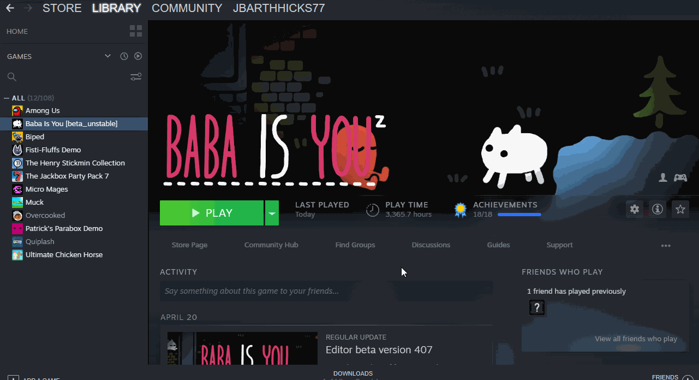

# Baba Is You - Better Metatext
**For game version: 424**
A mod that fully implements metatext into Baba Is You on Steam.

Metatext is text that refers to other text. For example, Baba metatext refers to the text that refers to Baba. So it's essentially modifying one kind of text block. Here's a gif of it now that I know how to add those:

The concept comes from a side effect of how text works in the base game, but it is very limited. This mod removes these limitations.

# How to use
To install, place the Lua and Sprite folders in your levelpack folder, and write "mods = 1" without quotations inside of world_data.txt (located in the same folder) under [General]. Be sure to restart the game after doing this. Like this:

The lua file named "text_ prefix" adds the only real new feature as of now. It is not required for the rest of the mod to work. **If you choose to leave out this file, the SPRITES folder is not needed.**

There are multiple ways to get metatext in your level.
- Use [this script](https://cdn.discordapp.com/attachments/560913551586492475/854541928611971086/metatext.zip) by Plasmaflare to add most level 1 metatext to the editor. This also comes with sprites! Install with the rest of the mod.
- Rename an object to "text_text_(name)" without quotations, with (name) being the name of the text you want to refer to. You can go deeper by naming an object "text_text_text_(name)" to refer to "text_text_(name)". **Make sure you set its text type to 0 (Baba)!**
-- There is now a new feature: The TEXT_ prefix, which allows you to refer to metatext without actually having metatext. Make TEXT_ BABA IS YOU to make the BABA text YOU! This can stack, so you can make TEXT_ TEXT_ BABA IS YOU to refer to TEXT_TEXT_BABA if it exists in the object palette. If you added the file that implements it, you can find it in the editor with the other objects. Here's it in action:

**Notes:** 
- For the TEXT_ prefix to work with letters, the letters need to have their metatext for them in the palette. This isn't required for other text types.
- This mod changes way too many functions, so it is most likely imcompatible with all other mods, including my own.
