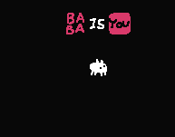
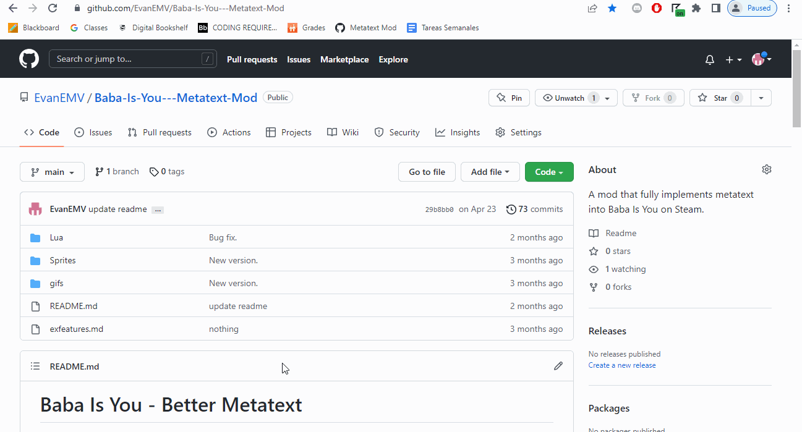

# Baba Is You - Better Metatext
**For game version: 433D**

A mod that fully implements metatext into Baba Is You on Steam.

Metatext is text that refers to other text. For example, Baba metatext refers to the text that refers to Baba. So it's essentially modifying one kind of text block. Here's a gif of it now that I know how to add those:

The concept comes from a side effect of how text works in the base game, but it is very limited. This mod removes these limitations.

# How to use
To install, place the Lua and Sprite folders in your levelpack folder, and write "mods = 1" without quotations inside of world_data.txt (located in the same folder) under [General]. Be sure to restart the game after doing this. Like this:

There are two optional files: one named "text_ prefix.lua" and one named "metaunmeta.lua". Neither are required for the rest of the mod to work, although they are recommended. **If you choose to leave out both files, the SPRITES folder is not needed.**

You can also enable or disable new features with the file "defines + misc.lua." Features documented [here](exfeatures.md).

There are multiple ways to get metatext in your level.
- Use [this script](https://cdn.discordapp.com/attachments/560913551586492475/854541928611971086/metatext.zip) by Plasmaflare to add most level 1 metatext to the editor. This also comes with sprites! Install with the rest of the mod.
- Rename an object to "text_text_(name)" without quotations, with (name) being the name of the text you want to refer to. You can go deeper by naming an object "text_text_text_(name)" to refer to "text_text_(name)". **Make sure you set its text type to 0 (Baba)!**
- A new feature with this mod: The TEXT_ prefix. More info [here](exfeatures.md).
- This new version has an option for creating additional metatext on the fly. More info [here](exfeatures.md).

**Notes:**
- For the TEXT_ prefix to work with letters, the letters need to have their metatext for them in the palette. This isn't required for other text types.
- This mod changes way too many functions, so it is most likely incompatible with all other mods, including my own.

**CREDITS**
- RocketRace#0798's ROBOT IS YOU bot for the Meta/Unmeta sprites
- Hempuli for making Baba Is You
- PlasmaFlare#5648 for reference on how to make readmes like this one
- me for everything else

If I forgot anyone else, write who I forgot and send a carrier pigeon to me. Or ping me on Discord, whichever's more convenient.
