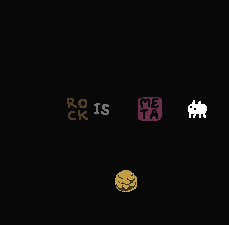
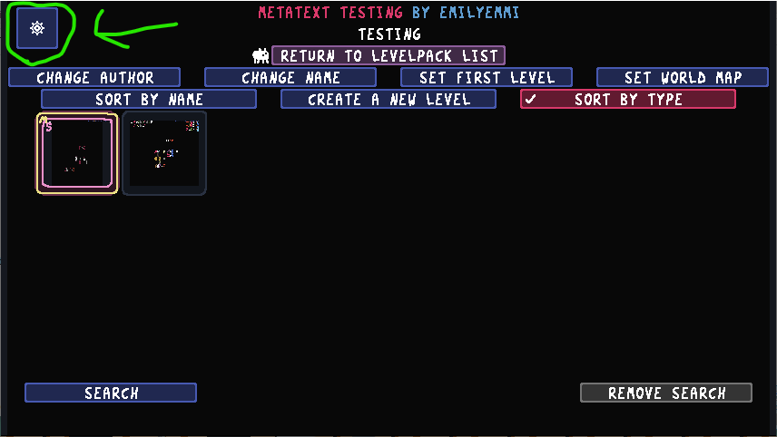

# Metatext mod features

In addition to implementing metatext, this mod comes with some new words that work with metatext, as well as some other features.

### TEXT_ prefix

This prefix goes before any word, parsing it as metatext. Make TEXT_ BABA IS YOU to make BABA text YOU!
Simply don't omit the file "text_ prefix.lua" to get this word.
Note: Baba will not send a text message.

### META / UNMETA

These properties change the meta level of text/objects:
- META raises the meta level. ROCK is changed to TEXT_ROCK, TEXT_ROCK is changed to TEXT_TEXT_ROCK, etc.
- UNMETA lowers the meta level. TEXT_TEXT_ROCK becomes TEXT_ROCK and TEXT_ROCK becomes ROCK. Texts that don't have an associated object won't be changed.

**These are considered transformations, so NOUN IS NOUN will disable them.**
Simply don't omit the file "metaunmeta.lua" to get this word.

## Settings menu

This lets you enable or disable certain features. It should appear in the top left in the levelpack menu, as seen here:

This is saved with your levelpack, so when you send it, it should be ready to go!
Here are the options available.

# Give warning if wrong version.

This option displays an error if the version of the game does not the version of this mod. NO by default. Note that the player can still continue.

# Fix issues with parity

This option changes some behaviors to match vanilla. YES by default. The changes it makes are as follows:
Making TEXT IS TELE specifically links all of the text together. Only text of the same type is linked if METATEXT IS TELE is formed.
Making TEXT IS MORE specifically does not allow text units to ever grow into each other. METATEXT IS MORE will allow it for text units of different types.
Making TEXT IS GROUP specifcally and NOUN HAS/MAKE GROUP will make the NOUN have/make only its own text type rather than every text in the level.

# Metatext Overlay

This option adds a number in the corner of metatext in certain situations:
- Set to "None" to turn this off. Default.
- Set to "Wrong sprite" to turn this on if the sprite's meta-ness does not match that of the object. More specifically, the amount of time "text_" appears in the name, minus one if the name ends with "text_".
- Set to "Always" to always enable the overlay.
Note that this is disabled in the editor now because of issues.

# Text Is Word

Makes all TEXT units WORD by default. Making them NOT WORD or BROKEN will prevent them from parsing. NO by default.

# 'Metatext is text' disables transform
# + 'Metatext has/make text' refers to text word

These are two seperate options. The first makes METATEXT IS TEXT not turn the specified text into it's metatext form. The second makes METATEXT HAS/MAKE TEXT refer to TEXT_TEXT instead of the specified text in its meta form. Both are NO by default.

# Automatically generate metatext

If metatext that doesn't exist in the palette tries to be created, it gets added to the pallete automatically. **Can only add to the first 35 slots assuming those slots also aren't filled in the palette. If it tries to create more, nothing happens.** Comes with the following options:
- Set to "Never" to disable this. Default.
- Set to "Try correct sprite" to have the auto generated text try to use the correct sprites if they exist. Otherwise, use the default sprites.
- Set to "Force correct sprite" to only generate if the correct sprites exist.
- Set to "Always same sprite" to always use the default sprites.
**If the text exists in the editor but not in the palette, it will be added instead.**
Report any bugs you find with this, because this kind of thing has the capability to ruin your object list.

# Easter egg

Not telling you what this does, but you can disable it. YES by default.

That's everything as of now!
